<div align="center">

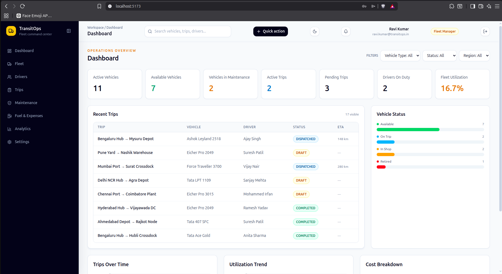

# TransitOps

### Smart Transport Operations Platform

**Replace fleet spreadsheets with a live operations console.**  
Dispatch trips · Monitor service windows · Track fuel costs · Keep compliance visible — all from one control room.

[](https://react.dev)
[](https://spring.io/projects/spring-boot)
[](https://openjdk.org)
[](https://postgresql.org)
[](https://tailwindcss.com)
[](https://vitejs.dev)

</div>

---

## Screenshots

<table>
  <tr>
    <td width="50%">
      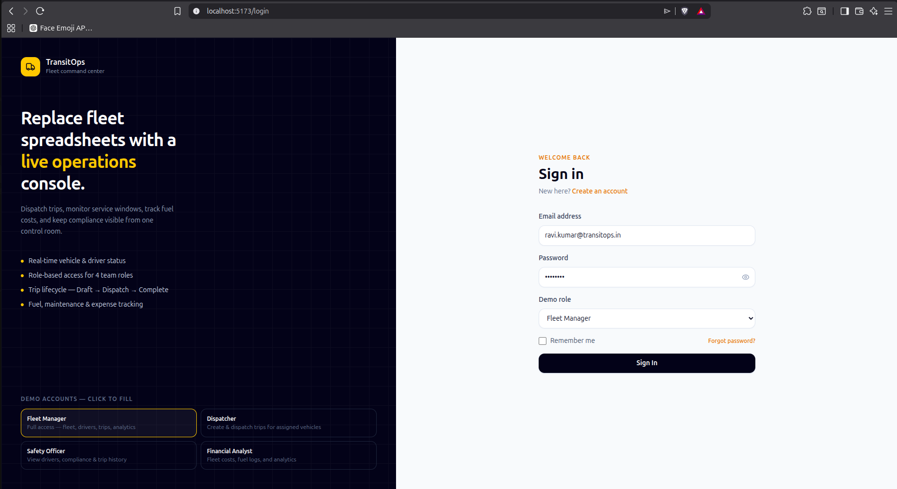
      <p align="center"><b>Sign In — role-based demo accounts</b></p>
    </td>
    <td width="50%">
      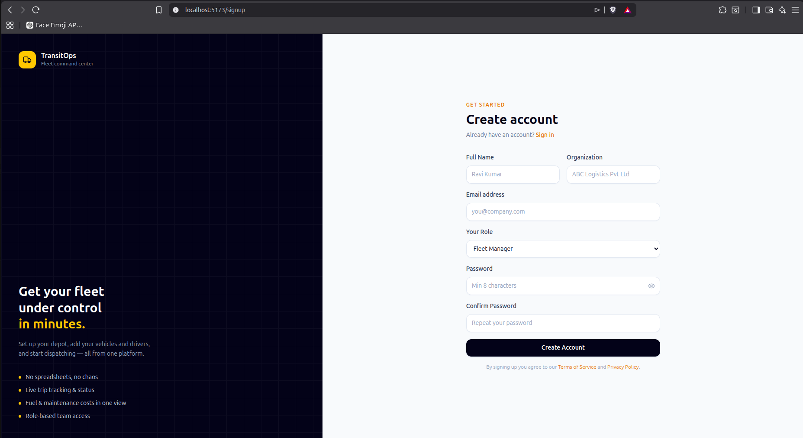
      <p align="center"><b>Sign Up — with password strength indicator</b></p>
    </td>
  </tr>
  <tr>
    <td width="50%">
      
      <p align="center"><b>Dashboard — live KPIs and trip overview</b></p>
    </td>
    <td width="50%">
      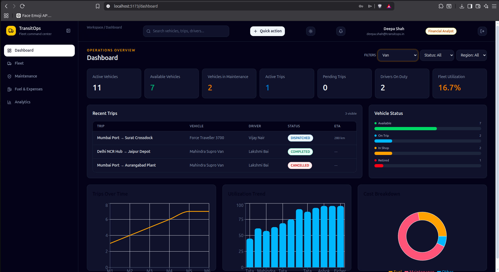
      <p align="center"><b>Dashboard — dark mode</b></p>
    </td>
  </tr>
  <tr>
    <td width="50%">
      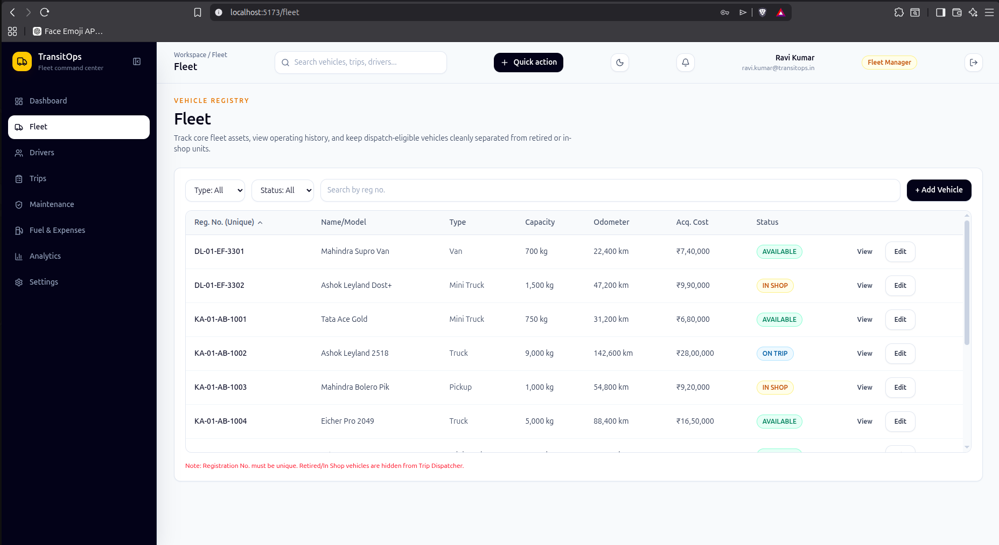
      <p align="center"><b>Fleet Registry — vehicle management</b></p>
    </td>
    <td width="50%">
      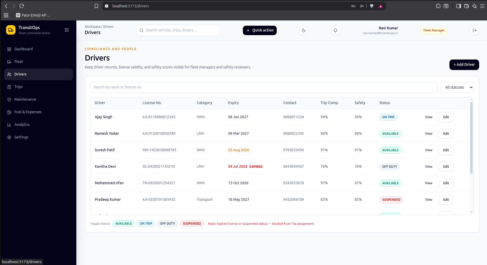
      <p align="center"><b>Drivers — compliance & safety profiles</b></p>
    </td>
  </tr>
  <tr>
    <td width="50%">
      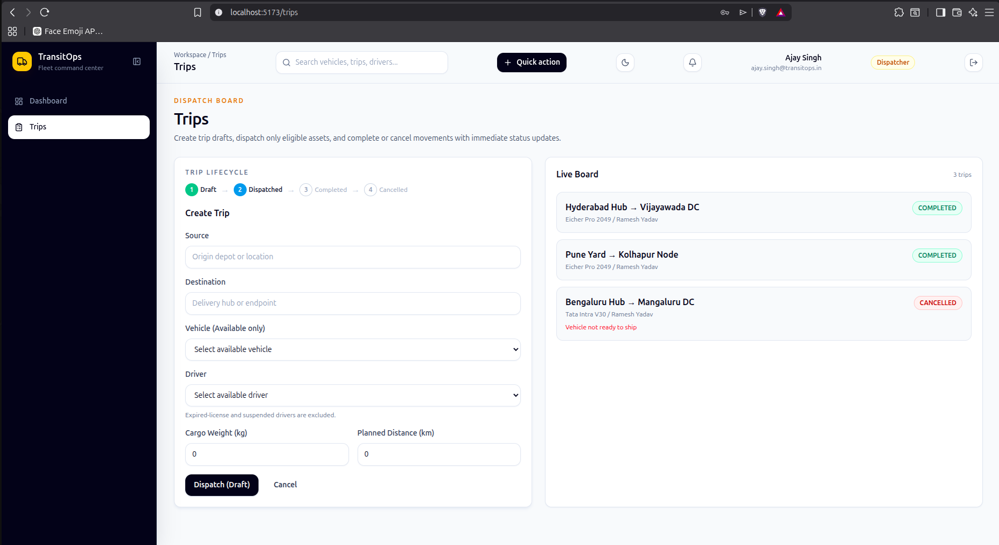
      <p align="center"><b>Trip Dispatcher — create & dispatch</b></p>
    </td>
    <td width="50%">
      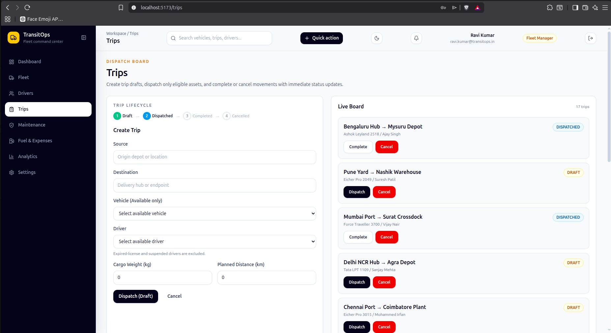
      <p align="center"><b>Trip Management — live board</b></p>
    </td>
  </tr>
  <tr>
    <td width="50%">
      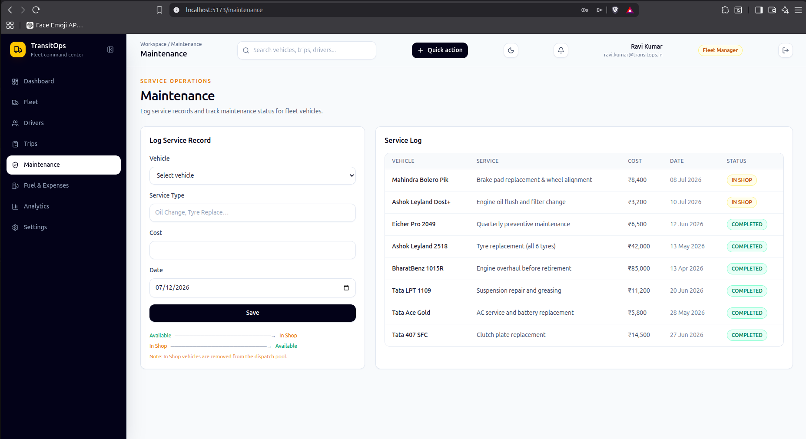
      <p align="center"><b>Maintenance — service log & status</b></p>
    </td>
    <td width="50%">
      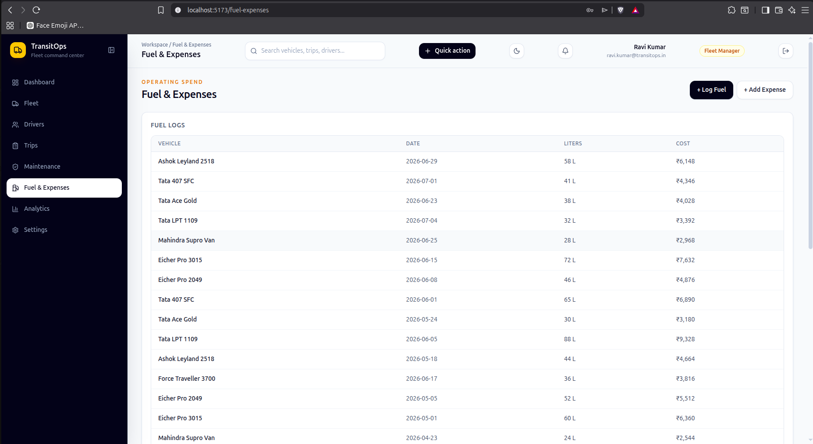
      <p align="center"><b>Fuel & Expenses — cost tracking</b></p>
    </td>
  </tr>
  <tr>
    <td width="50%">
      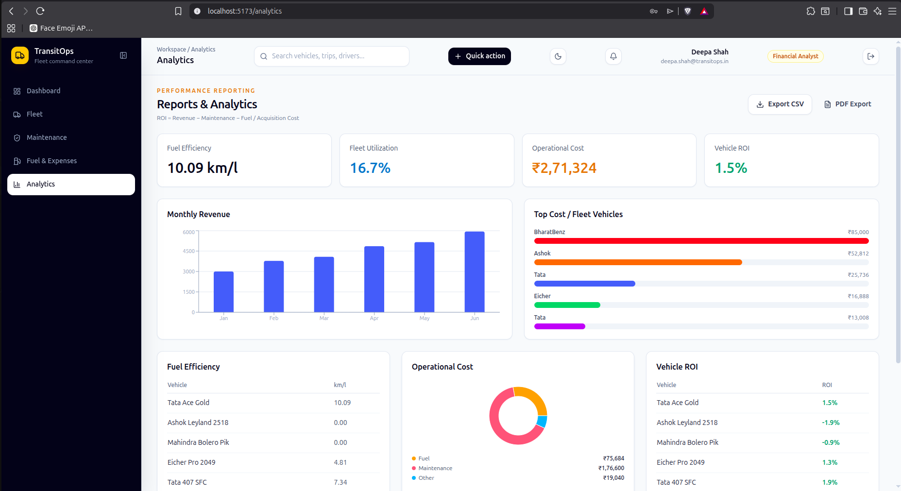
      <p align="center"><b>Analytics — charts & KPIs</b></p>
    </td>
    <td width="50%">
      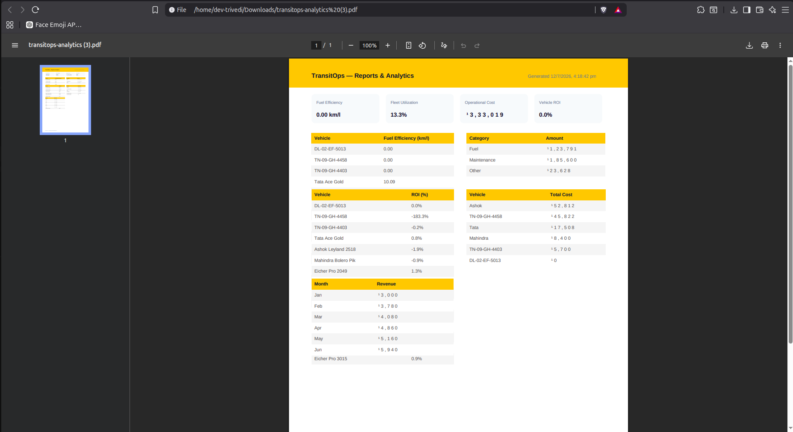
      <p align="center"><b>PDF Export — A4 analytics report</b></p>
    </td>
  </tr>
</table>

---

## Tech Stack

### Frontend

| Technology | Version | Purpose |
|---|---|---|
| [React](https://react.dev) | 18.3 | UI framework |
| [Vite](https://vitejs.dev) | 7.1 | Build tool & dev server |
| [Tailwind CSS](https://tailwindcss.com) | 3.4 | Utility-first styling |
| [React Router](https://reactrouter.com) | v6 | Client-side routing & protected routes |
| [React Hook Form](https://react-hook-form.com) | 7 | Form state management |
| [Zod](https://zod.dev) | 4 | Schema validation |
| [Recharts](https://recharts.org) | 3 | Bar, pie, and line charts |
| [jsPDF](https://github.com/parallax/jsPDF) | latest | PDF generation |
| [jspdf-autotable](https://github.com/simonbengtsson/jsPDF-AutoTable) | latest | PDF table rendering |
| [Sonner](https://sonner.emilkowal.ski) | 2 | Toast notifications |
| [Lucide React](https://lucide.dev) | 0.542 | Icon set |
| [Axios](https://axios-http.com) | 1.11 | HTTP client |
| [date-fns](https://date-fns.org) | 4 | Date formatting & manipulation |

### Backend

| Technology | Version | Purpose |
|---|---|---|
| [Java](https://openjdk.org) | 21 | Language |
| [Spring Boot](https://spring.io/projects/spring-boot) | 4.1 | Application framework |
| [Spring Security](https://spring.io/projects/spring-security) | 4.1 | Authentication & authorization |
| [Spring Data JPA](https://spring.io/projects/spring-data-jpa) | 4.1 | ORM / database abstraction |
| [Hibernate](https://hibernate.org) | 6 | JPA implementation |
| [PostgreSQL](https://www.postgresql.org) | 15 | Production database |
| [H2](https://h2database.com) | latest | In-memory DB for dev/test |
| [JJWT](https://github.com/jwtk/jjwt) | 0.11.5 | JWT token generation & validation |
| [Lombok](https://projectlombok.org) | latest | Boilerplate reduction |
| [Bean Validation](https://beanvalidation.org) | 3 | Request payload validation |
| [Maven](https://maven.apache.org) | 3.9 | Build & dependency management |

---

## Features

### 🔐 Authentication & Role-Based Access
- JWT-based stateless authentication
- 4 roles: Fleet Manager, Dispatcher, Safety Officer, Financial Analyst
- Route-level and component-level access control
- Automatic session restoration from sessionStorage

### 📊 Dashboard
- 7 live KPI cards with real-time counts
- Filterable recent trips table (by vehicle type, status, region)
- Vehicle status distribution with animated progress bars
- Full dark mode support

### 🚚 Fleet Registry
- Complete vehicle CRUD with duplicate registration validation
- Sortable & filterable table (type, status, free-text search)
- Per-vehicle operational cost calculation
- Retired/In Shop vehicles automatically excluded from dispatch

### 👨‍✈️ Driver Compliance
- License expiry tracking with red EXPIRED alerts
- SUSPENDED + EXPIRED drivers blocked from trip assignment
- Safety score per driver
- Auto-update driver status based on active trips

### 🗺️ Trip Dispatcher
- Full lifecycle: Draft → Dispatched → Completed → Cancelled
- Smart vehicle picker (AVAILABLE only)
- Smart driver picker (excludes ON_TRIP, SUSPENDED, EXPIRED)
- Live capacity validation — alerts when cargo exceeds vehicle limit
- Trip completion captures final odometer & fuel consumed

### 🔧 Maintenance
- Log service records with vehicle, type, cost, and date
- Vehicle automatically moves to IN_SHOP on log creation
- Vehicle returns to AVAILABLE when service is closed
- Split layout: form on left, service log table on right

### ⛽ Fuel & Expenses
- Fuel log entries linked to trips
- Miscellaneous expenses (tolls, permits, allowances)
- Total Operational Cost = Fuel + Maintenance + Other
- All costs displayed in Indian Rupees (₹)

### 📈 Analytics & PDF Export
- Fuel efficiency per vehicle (km/l)
- Fleet utilization percentage
- Monthly revenue bar chart
- Top cost vehicles horizontal bar chart
- Operational cost donut chart (Fuel / Maintenance / Other)
- Vehicle ROI table
- **One-click PDF export** — styled A4 report with all data

### ⚙️ Settings & RBAC Editor
- Editable role-to-page access matrix
- Click cells to cycle: None → View → Full
- General depot settings (name, currency, distance unit)

---

## Roles & Access

| Page | Fleet Manager | Dispatcher | Safety Officer | Financial Analyst |
|---|:---:|:---:|:---:|:---:|
| Dashboard | ✅ Full | ✅ Own | ✅ Full | ✅ Full |
| Fleet | ✅ Full | ❌ | ❌ | 👁️ View |
| Drivers | ✅ Full | ❌ | 👁️ View | ❌ |
| Trips | ✅ Full | ✅ Full | 👁️ View | ❌ |
| Maintenance | ✅ Full | ❌ | ❌ | 👁️ View |
| Fuel & Expenses | ✅ Full | ❌ | ❌ | ✅ Full |
| Analytics | ✅ Full | ❌ | ❌ | ✅ Full |
| Settings | ✅ Full | ❌ | ❌ | ❌ |

---

## Quick Start

### Frontend (mock mode — no backend needed)

```bash
cd frontend
npm install
# ensure VITE_USE_MOCKS=true in frontend/.env
npm run dev
# → http://localhost:5173
```

### Backend

```bash
# Start PostgreSQL and create DB
psql -c "CREATE DATABASE transitops_dev;"

cd backend
./mvnw spring-boot:run
# → http://localhost:8081
```

### Frontend with real backend

```bash
# frontend/.env
VITE_API_BASE_URL=http://localhost:8081
VITE_USE_MOCKS=false
```

---

## Demo Accounts

All accounts use password `admin123`.

| Role | Email | Access |
|---|---|---|
| Fleet Manager | ravi.kumar@transitops.in | Everything |
| Dispatcher | ajay.singh@transitops.in | Dashboard + Trips |
| Safety Officer | priya.nair@transitops.in | Drivers + Trips (view) |
| Financial Analyst | deepa.shah@transitops.in | Fleet (view) + Fuel + Analytics |

---

## Project Structure

```
transitops/
├── frontend/          # React + Vite app
│   ├── src/
│   │   ├── api/       # API layer with mock adapter
│   │   ├── components/# Reusable UI + layout components
│   │   ├── context/   # Auth, AppData, Theme contexts
│   │   ├── pages/     # 11 page components
│   │   └── utils/     # calculations, pdf, csv, dates
│   └── README.md
├── backend/           # Spring Boot API
│   ├── src/main/java/com/hackathon/transitops/
│   │   ├── controller/
│   │   ├── service/
│   │   ├── entity/
│   │   ├── repository/
│   │   ├── security/
│   │   └── config/
│   └── README.md
└── README.md          # ← you are here
```

---

## Documentation

- [Frontend README](frontend/README.md) — component docs, page breakdown, mock data, environment config
- [Backend README](backend/README.md) — API reference, entity models, security, deployment

---

<div align="center">
  <p>Built for hackathon · TransitOps Fleet Management</p>
</div>
